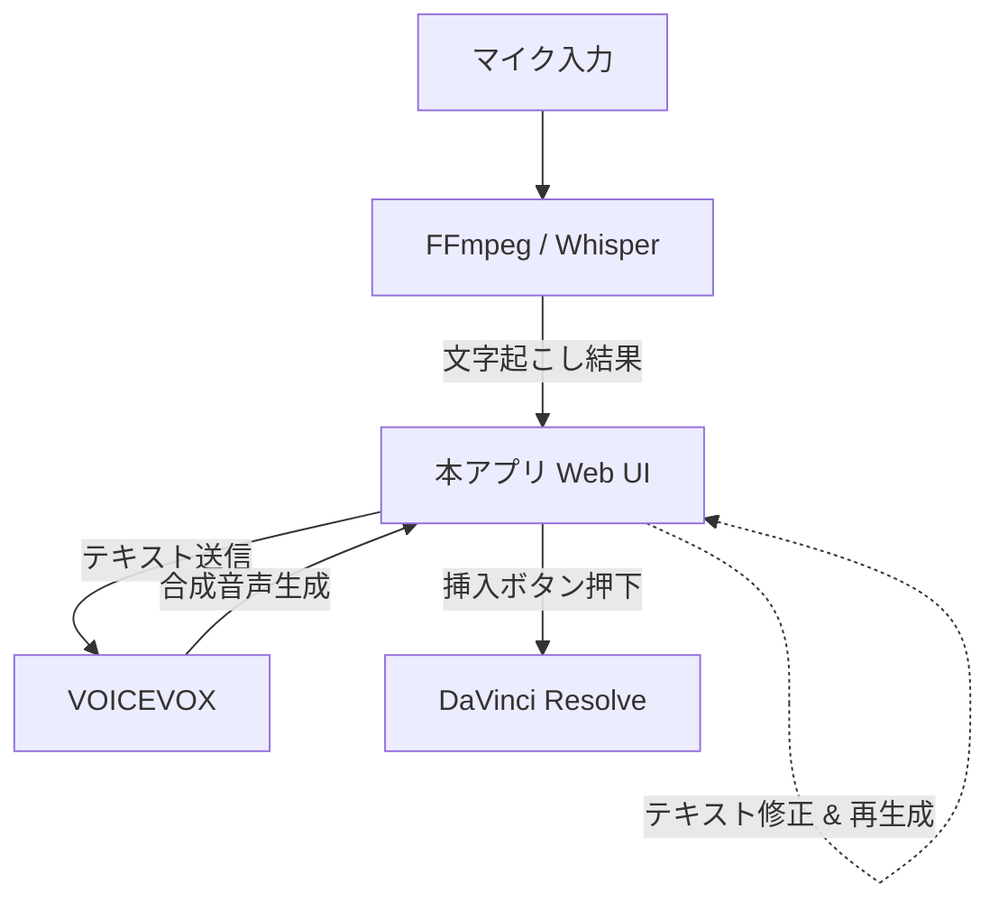
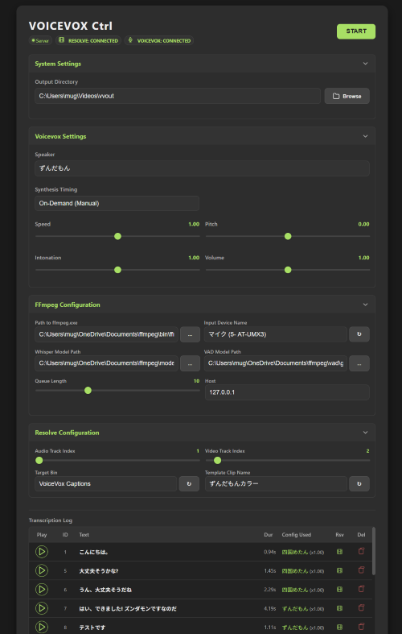

# FFmpeg Voicevox Integration

マイク入力をリアルタイムで文字起こしし、VOICEVOXによる音声合成と動画編集ソフト（DaVinci Resolve）への素材挿入を効率化するための支援ツールです。
動画編集における「声入れ」と「字幕入れ」の作業を、シームレスなワークフローで劇的に加速させます。

## 基本フロー

本アプリは、マイクからの音声入力をきっかけとし、文字起こし、音声合成、動画編集ソフトへの取り込みまでを一貫して管理します。



### 各コンポーネントの役割

*   **FFmpeg (Whisper フィルター内蔵)**: 音声のキャプチャ、および Whisper による高精度なリアルタイム文字起こしを担当します。
*   **VOICEVOX**: 確定したテキスト（または修正後のテキスト）から、豊かな表情を持つ合成音声を生成します。
*   **DaVinci Resolve**: 最終的な動画制作の場です。本アプリで生成された音声ファイルと字幕テキストは、挿入ボタンをクリックすることでタイムラインの指定位置へ配置されます。

### 本アプリの役割（司令塔）

本アプリは、これら強力な外部ツールを繋ぐ「ハブ」として機能します。

*   **オーケストレーション**: 音声認識から合成、編集ソフトへの橋渡しまでの一連のプロセスを効率化します。
*   **柔軟な修正ループ**: 文字起こしの誤認識があった場合でも、**UI上でテキストを修正して即座に音声を再生成・挿入**できる環境を提供します。
*   **資産管理**: 過去の生成履歴をデータベース化。過去のフレーズの再利用や、後からの微調整を容易にします。

## WebUI 管理画面



## 主な機能

### 🎯 ユーザー体験 (User Experience)
*   **シームレスな編集ループ**: 文字起こしの誤認識をWeb UI上で即座に修正し、ワンクリックで音声を再生成・DaVinci Resolveへ挿入（更新）できます。
*   **高解像度対応 (High DPI)**: Windows環境ではOSネイティブなダイアログを採用。高DPIディスプレイでもぼやけない、鮮明でモダンな操作感を提供します。
*   **ブラウザ自動管理**: `SharedWorker` 採用により、複数タブを開いても負荷を最小限に。サーバー再起動時の自動リロードや、重複タブの自動クリーンアップも備えています。

### ⚙️ 高度な自動化・効率化 (Automation)
*   **インテリジェント・スタートアップ**: 
    *   **二重起動防止**: 古いプロセスを自動検知してクリーンアップ。DBロックやポート競合を未然に防ぎます。
    *   **ポート自動検索**: 使用中のポートを自動回避し、常に安定した起動を保証します。
*   **オート・シャットダウン (Eco-friendly)**: 快適な作業後、一定時間アクティビティがない場合にリソースを節約するため、システムを自動的に安全終了します。

### 💾 信頼性とパフォーマンス (Reliability & Performance)
*   **SSD寿命の最適化**: SQLiteの処理をメモリ上で完結させる（Journal Mode: MEMORY / Temp Store: MEMORY 等）ことで、ディスクへの書き込みを劇的に削減。大切なPCのストレージ寿命を保護しながら、高速なレスポンスを実現します。
*   **不整合の徹底排除**: 生成された各音声ファイルにはテキスト内容に基づくハッシュが付与されます。内容を書き換えると古いファイルは自動的に破棄され、常に「最新のテキスト」と「音声」が一致する状態を保ちます。

## 開発環境構築

### 必須要件

#### 基本環境
*   **OS**: Windows / macOS
*   **Python**: 3.x

#### 外部ツール・モジュール

##### Python
*   **用途**: アプリケーション本体の実行
*   **インストール方法**:
    *   **Windows**: [Microsoft Store](https://apps.microsoft.com/store/detail/python-310/9PJPW5LD6L98) からインストールすることを強く推奨します。これにより、環境変数（Path）への追加が確実に行われます。
    *   **macOS / Linux**: 公式サイトまたは各パッケージマネージャー（brew等）からインストールしてください。

##### FFmpeg
*   **用途**: 音声ファイルの変換・処理
*   **公式サイト**: [https://ffmpeg.org/](https://ffmpeg.org/)
*   **ダウンロード**: [https://ffmpeg.org/download.html](https://ffmpeg.org/download.html)
*   **インストール**: 任意のディレクトリに展開し、そのディレクトリを`config.json`の`ffmpeg_path`で指定してください。

##### Whisper C++ (GGML) モデル
*   **用途**: 音声認識(文字起こし)
*   **GitHubリポジトリ**: [https://github.com/ggerganov/whisper.cpp](https://github.com/ggerganov/whisper.cpp)
*   **モデルファイル**: 
    *   推奨モデル (スペック・用途に合わせて選択): 
        *   `ggml-large-v3-turbo.bin` (**標準推奨**: 精度はv2相当、速度は飛躍的に向上。VRAM 6GB以上推奨)
        *   `ggml-large-v3.bin` (**最高精度**: 処理時間は長いが最も正確。VRAM 10GB以上推奨)
        *   `ggml-small.bin` (**低スペック/省メモリ**: VRAM 2GB程度の環境やCPU処理向け)
    *   **直接ダウンロード**: 
        *   [ggml-large-v3-turbo.bin (Hugging Face)](https://huggingface.co/ggerganov/whisper.cpp/resolve/main/ggml-large-v3-turbo.bin)
        *   [ggml-large-v3.bin (Hugging Face)](https://huggingface.co/ggerganov/whisper.cpp/resolve/main/ggml-large-v3.bin)
        *   [ggml-small.bin (Hugging Face)](https://huggingface.co/ggerganov/whisper.cpp/resolve/main/ggml-small.bin)
        *   リポジトリ: [ggerganov/whisper.cpp (Hugging Face)](https://huggingface.co/ggerganov/whisper.cpp/tree/main)
*   **設定**: ダウンロードしたモデルファイルのパスを`config.json`の`model_path`で指定してください。

##### VAD (Voice Activity Detection) モデル
*   **用途**: 音声区間検出(Sileroモデルを使用、Whisper C++で使用)
*   **GitHubリポジトリ**: [https://github.com/snakers4/silero-vad](https://github.com/snakers4/silero-vad)
*   **モデルファイル**: 
    *   推奨モデル: `ggml-silero-v6.2.0.bin` (GGML形式、Whisper C++用)
    *   **直接ダウンロード**: 
        *   [ggml-silero-v6.2.0.bin (Hugging Face)](https://huggingface.co/ggml-org/whisper-vad/resolve/main/ggml-silero-v6.2.0.bin)
        *   リポジトリ: [ggml-org/whisper-vad](https://huggingface.co/ggml-org/whisper-vad)
*   **設定**: ダウンロードしたGGMLファイルのパスを`config.json`の`vad_model_path`で指定してください。

##### VOICEVOX
*   **用途**: 音声合成エンジン
*   **公式サイト**: [https://voicevox.hiroshiba.jp/](https://voicevox.hiroshiba.jp/)
*   **GitHubリポジトリ**: [https://github.com/VOICEVOX/voicevox](https://github.com/VOICEVOX/voicevox)
*   **ダウンロード**: 
    *   エディタ版: [VOICEVOX公式サイト](https://voicevox.hiroshiba.jp/)
    *   エンジン版: [VOICEVOX ENGINE Releases](https://github.com/VOICEVOX/voicevox_engine/releases)
*   **起動**: アプリケーション実行前にVOICEVOXを起動してください（デフォルト: `http://127.0.0.1:50021`）。
*   **設定**: `config.json`で接続先URLやスピーカーIDなどを変更可能です。

##### DaVinci Resolve (オプション)
*   **用途**: 動画編集ソフトとの連携（音声・字幕の自動挿入）
*   **公式サイト**: [https://www.blackmagicdesign.com/products/davinciresolve](https://www.blackmagicdesign.com/products/davinciresolve)
*   **要件**: 連携機能を使用する場合、DaVinci Resolveが起動しており、スクリプトAPIが有効であること。

### セットアップ手順

1.  **依存ライブラリのインストール**
    ```powershell
    pip install -r requirements.txt
    ```

2.  **VOICEVOXの準備**
    VOICEVOXを起動してください。デフォルトでは `http://127.0.0.1:50021` を使用します（`config.json` で変更可能）。

## 実行方法

1.  **VOICEVOXの起動**: 
    VOICEVOXを起動してください（エディタ版またはエンジン版のどちらでも構いません）。バックグラウンドで起動しているだけで問題ありません。

2.  **アプリケーションの起動**:
    以下のコマンドを実行してアプリケーションを起動します。
```powershell
python voicevox_controller.py
```
起動後、ブラウザが自動的に開き、管理画面が表示されます。

## 使い方

1.  **設定の確認**
    管理画面の各セクション（FFmpeg Configuration, Resolve Configuration等）を展開し、各種パスやデバイス設定が正しいことを確認してください。
    > [!IMPORTANT]
    > STARTボタンを有効にするには、以下の条件を満たしている必要があります。
    > 1. **VOICEVOXの起動**: VOICEVOXが起動しており、画面上部の **[VOICEVOX CONNECTED]** インジケータが点灯していること。
    > 2. **出力ディレクトリの設定**: `Output Directory` が正しく設定されていること。
    > 3. **FFmpegパスの設定**: `FFmpeg Configuration` で正しいパスが指定されていること。

2.  **文字起こしの開始**
    画面右上の **[START]** ボタンを押すと、FFmpegが起動し、マイク入力のリアルタイム文字起こしが開始されます。

3.  **音声合成と連携**
    *   **自動生成**: `Synthesis Timing` が `Immediate` に設定されている場合、文字起こし確定と同時にVOICEVOXによる音声合成が実行されます。
    *   **素材の挿入**: ログに表示された各アイテムの「挿入」ボタンを押すことで、DaVinci Resolveのタイムラインへ音声と字幕が配置されます。

4.  **修正と再実行**
    文字起こしに誤りがある場合は、UI上でテキストを直接編集できます。編集後に再生成ボタンを押すことで、修正後のテキストで音声を即座に作り直すことが可能です。
    > [!NOTE]
    > テキストの編集および音声の再生成は、システムが **STOP（停止）** 状態の時のみ可能です。START（動作中）は編集がロックされます。

## プロジェクト構成

*   `voicevox_controller.py`: アプリケーションのエントリーポイント。
*   `app/`: コアロジック、API、Web UI のソースコード。
*   `static/` / `templates/`: フロントエンド資産。
*   `config.json`: ユーザー設定。
*   `data/`: 生成された音声ファイルや履歴データベース（SQLite）。
*   `doc/specification/`: 詳細な仕様ドキュメント。

詳細については、`doc/` フォルダ内の仕様書を参照してください。
