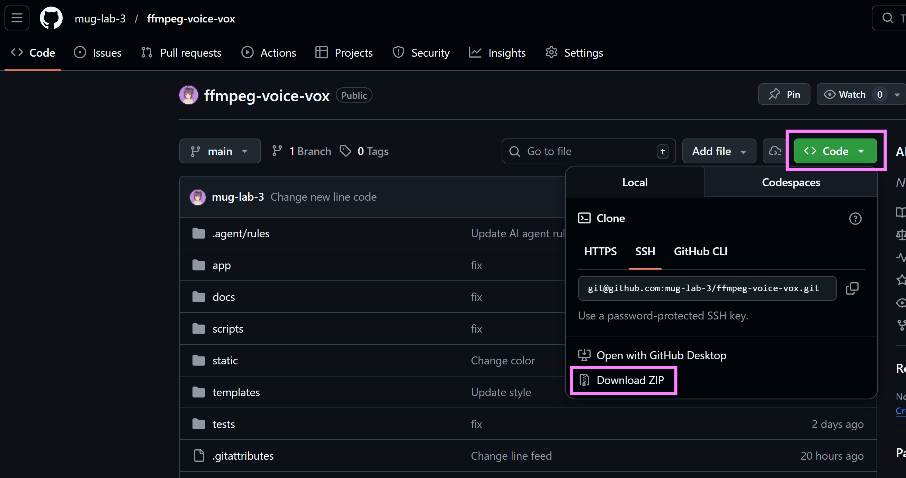
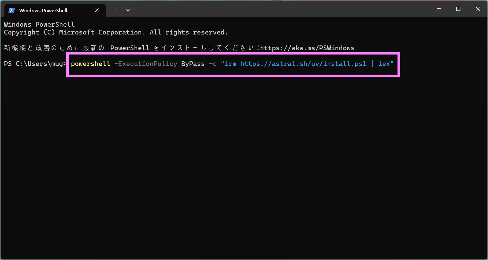
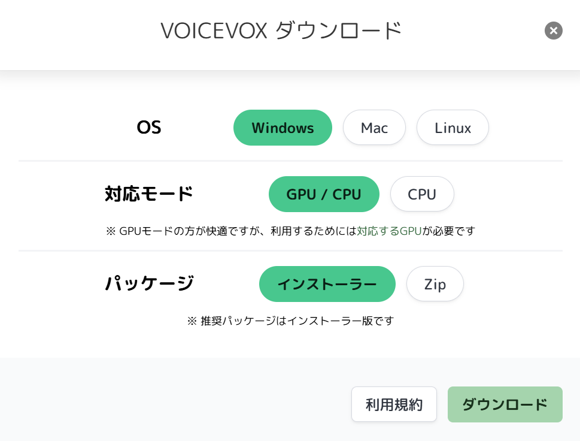
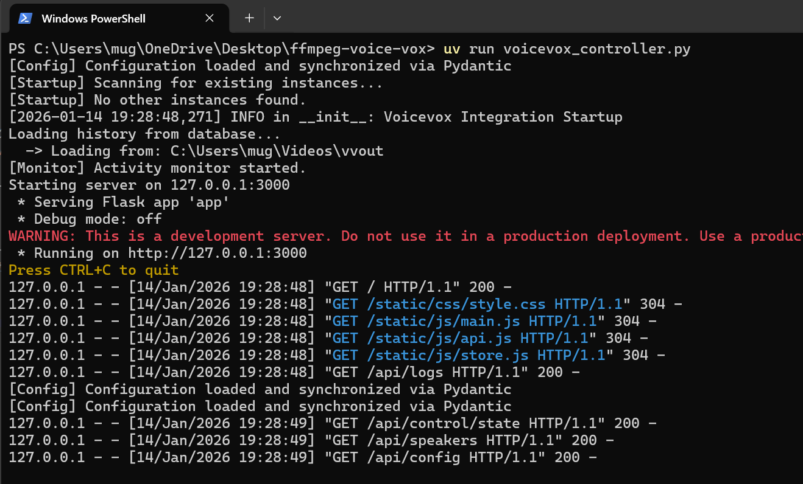
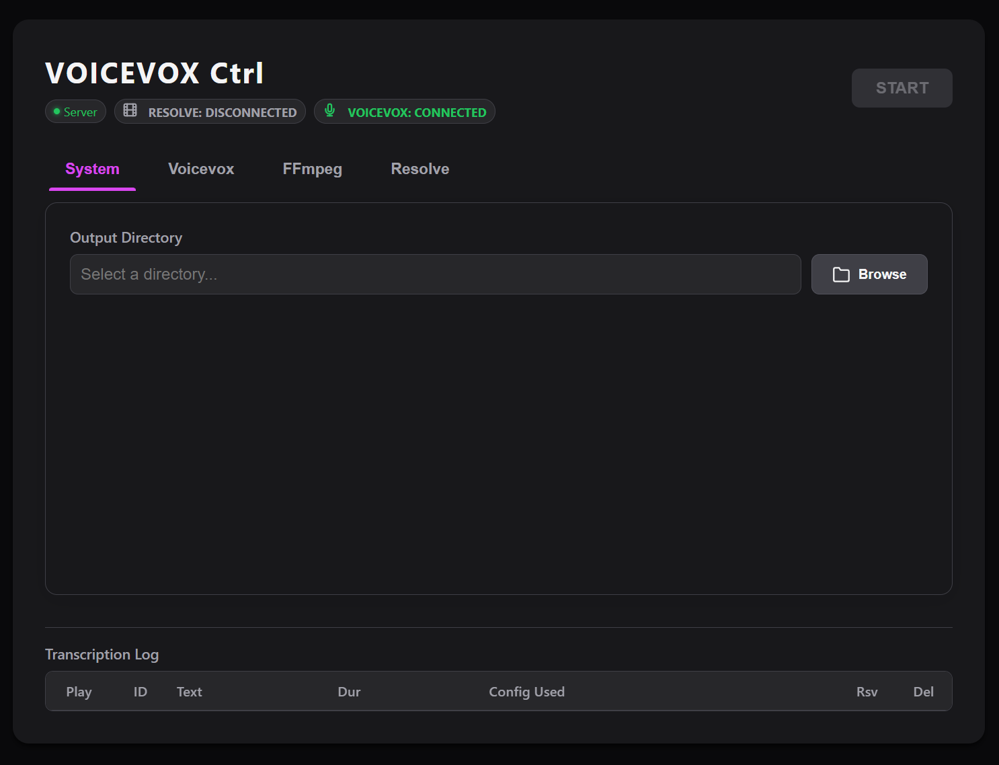
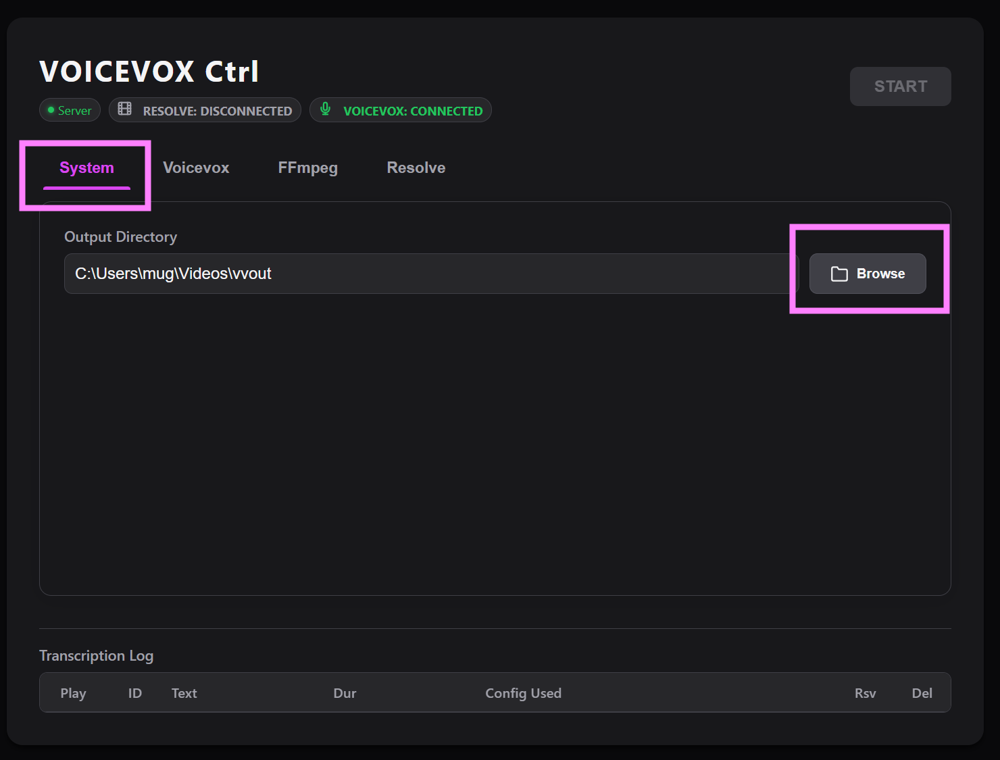
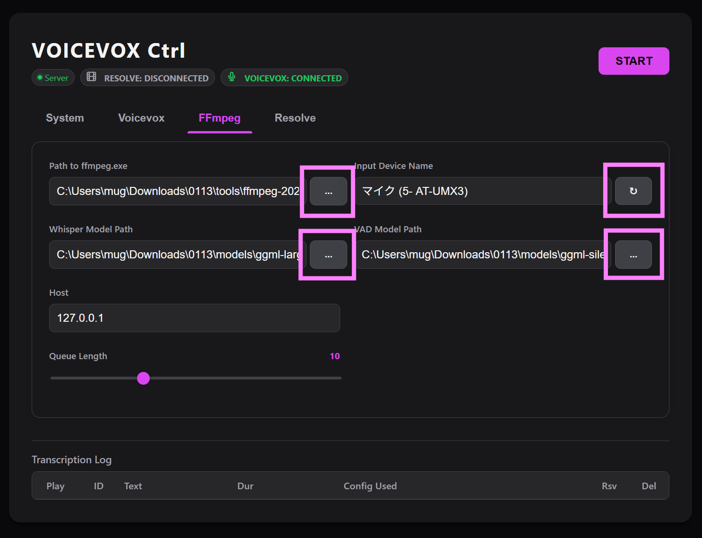
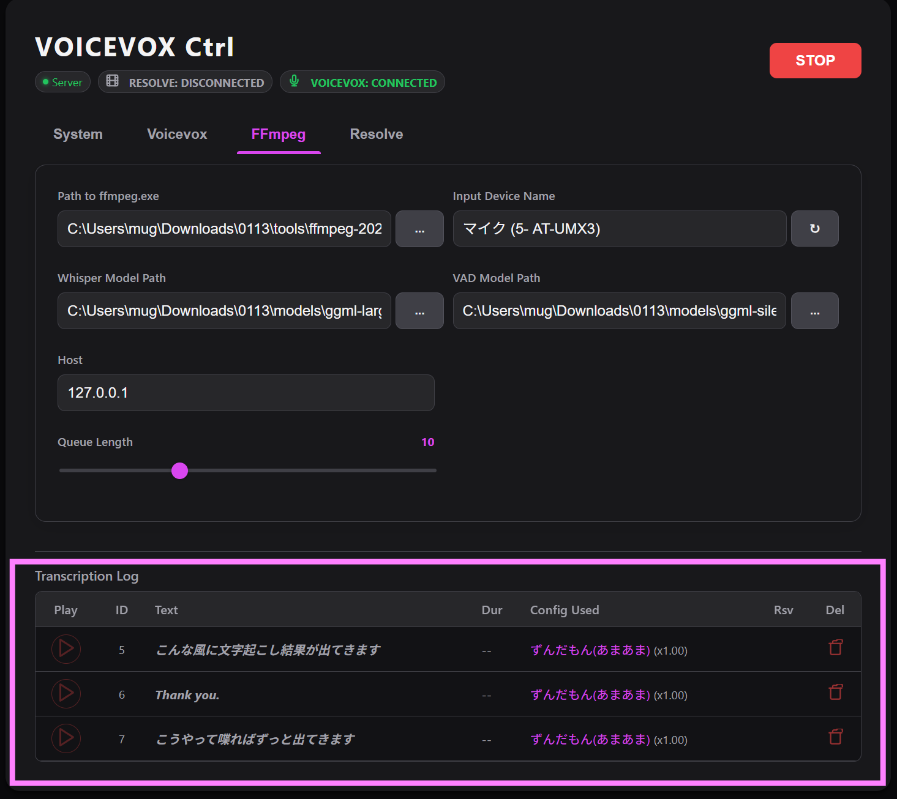

# セットアップガイド

本アプリケーションを使用するためのセットアップ手順です。  
外部ツールの取得から配置、起動後の設定までを説明します。

> [!NOTE]  
> Windows の場合は自動セットアップスクリプト (`install.bat`) も用意されていますが、本ガイドではエラー時の対応や仕組みを理解するための「手動セットアップ」を中心に解説します。

---

## 1. アプリケーション（本体）の入手

まずは GitHub から本アプリのソースコードをダウンロードします。

1. [GitHub リポジトリ](https://github.com/mug-lab-3/ffmpeg-voice-vox)にアクセスします。
2. 右上の緑色の **[<> Code]** ボタンをクリックします。
3. **[Download ZIP]** を選択します。
   
4. ダウンロードした ZIP ファイルを、デスクトップなど任意の場所に展開（解凍）します。

---

## 2. 実行環境 (uv) の準備

本アプリは Python の高速な環境管理ツール **[uv](https://docs.astral.sh/uv/)** を使用して実行します。  
**`uv` が Python 自体も自動でダウンロード・管理するため、別途 Python をインストールする必要はありません。**

### Windows の場合
1. スタートメニューを右クリックして「ターミナル」（または PowerShell）を開きます。
2. 以下のコマンドをコピーして貼り付け、実行します。
   ```powershell
   powershell -ExecutionPolicy ByPass -c "irm https://astral.sh/uv/install.ps1 | iex"
   ```
   
3. インストール完了後、 **一度ターミナルを閉じて** 開き直すことで `uv` コマンドが使えるようになります。

### Mac の場合
1. ターミナルを開き、以下のコマンドを実行します。
   ```bash
   curl -LsSf https://astral.sh/uv/install.sh | sh
   ```
2. あるいは、Homebrew を使用している場合は `brew install uv` でもインストール可能です。

---

## 3. 外部ツールの取得と配置

アプリを動かすために必要なツールをダウンロードし、アプリのフォルダ内の `tools` や `models` に配置します。

### フォルダ構成のイメージ
以下のような構成を目指してファイルを配置していきます。
```text
ffmpeg-voice-vox/（アプリのルート）
├── tools/
│   └── ffmpeg/
│       ├── bin/（Windows の場合。中に ffmpeg.exe が入る）
│       └── ffmpeg（Mac の場合。実行ファイル本体）
├── models/
│   ├── ggml-large-v3-turbo.bin（Whisper モデル）
│   └── ggml-silero-v6.2.0.bin（VAD モデル）
├── voicevox_controller.py
└── ...
```

### 3-1 FFmpeg (Whisper 対応版)
通常の FFmpeg ではなく、音声認識機能 (Whisper) が内蔵されたものが必要です。

- **Windows**: [Gyan.dev (配布ページ)](https://www.gyan.dev/ffmpeg/builds/) から [ffmpeg-git-full.7z (直接ダウンロード)](https://www.gyan.dev/ffmpeg/builds/ffmpeg-git-full.7z) を入手・展開します。展開されたフォルダの中にある `bin` などのフォルダを、まるごと `tools/ffmpeg/` にコピーしてください。
  - > [!TIP]  
    > `tools/ffmpeg/bin/ffmpeg.exe` というフォルダ構成になれば正解です。
- **Mac**: [Evermeet.cx](https://evermeet.cx/ffmpeg/) 等から最新のビルドを入手するか、Whisper フィルターが有効なビルドを準備してください。
  - > [!TIP]
    > Mac 版は通常 **`ffmpeg` という 1 つの実行ファイルのみ**です。これを `tools/ffmpeg/` フォルダの直下に配置してください。

### 3-2 VOICEVOX
音声合成エンジンです。  
セットアップ手順簡略化のため、エディタ版（通常版）を用意します。

1. [VOICEVOX 公式サイト](https://voicevox.hiroshiba.jp/) からダウンロードします。
   > [!TIP]
   > **どのバージョンを選べばいい？**
   > - **対応OS**: お使いの PC に合わせて選択してください。
   > - **モード**: 
   >   - **GPU (DirectML / NVIDIA) [推奨]**: 高性能なグラフィックボード（GPU）を利用して高速に音声を生成します。GPU がない場合でも自動的に CPU で動作するため、**基本的にはこちらを選べば OK** です。
   >   - **CPU**: ダウンロードサイズが小さく非常に軽量です。古い PC や、ディスク容量を極限まで節約したい場合のみ選択してください。
   > - **パッケージ形式**: 
   >   - **インストーラー版 [推奨]**: 公式で推奨されている形式です。PC にインストールして起動しておくだけで本アプリと自動的に連携します。
   >   - **ZIP版**: アプリをインストールしたくない場合や、特定のフォルダでポータブルに管理したい場合に使用します。
   >
   > 
2. ダウンロードしたファイルを実行してインストール（インストーラー版）、または任意の場所に展開（ZIP版）してください。


### 3-3 学習済みモデル (Whisper / VAD)
音声を解析して発話区間を特定したり、文字に書き起こしたりするために必要なデータファイルです。  
これら 2 つのファイルを `models/` フォルダに配置します。

#### 3-3-1 Whisper モデル（音声 → 文字 の変換）
録音された音声を解析し、言葉（テキスト）に書き起こすための中心的なモデルです。

1. **ダウンロード**: [ggerganov/whisper.cpp (公式リポジトリ)](https://huggingface.co/ggerganov/whisper.cpp/tree/main) から **[ggml-large-v3-turbo.bin (直接ダウンロード)](https://huggingface.co/ggerganov/whisper.cpp/resolve/main/ggml-large-v3-turbo.bin)** を入手します。
   > [!TIP]  
   > **PC スペックに応じたモデルの選び方**
   > - `ggml-large-v3-turbo.bin` (**推奨**): 速度と精度のバランスが良く、多くの方に最適です。
   > - `ggml-large-v3.bin`: 最も高精度ですが、動作が重くなります。（VRAM 10GB 以上推奨）
   > - `ggml-small.bin`: 動作が非常に軽く、古い PC や CPU のみで動かす場合に適しています。
   >
   > 他のモデルは [ggerganov/whisper.cpp (Hugging Face)](https://huggingface.co/ggerganov/whisper.cpp/tree/main) から入手可能です。

#### 3-3-2 VAD モデル（発話区間の検出）
「いま人が話しているか、いないか」を判断するためのモデルです。  
無音部分をカットし、Whisper が処理すべき箇所を正しく教える役割を担います。

1. **ダウンロード**: [ggml-org/whisper-vad (公式リポジトリ)](https://huggingface.co/ggml-org/whisper-vad) から **[ggml-silero-v6.2.0.bin (直接ダウンロード)](https://huggingface.co/ggml-org/whisper-vad/resolve/main/ggml-silero-v6.2.0.bin)** を入手します。

---

## 4. アプリの起動

### 起動の手順
1. **VOICEVOX** を先に起動しておきます。
2. 本アプリをダウンロード・展開したフォルダ（`ffmpeg-voice-vox`）を **右クリック** してターミナルを開きます。
   - **Windows**: 「ターミナルで開く」を選択します。
   - **Mac**: 「フォルダに新規ターミナル」を選択します。
3. 以下のコマンドを実行します（Windows/Mac 共通）。
   ```bash
   uv run voicevox_controller.py
   ```
   
4. 初回起動時は、実行環境の構築（Python やライブラリのダウンロード）が行われるため数分かかります。  
完了するとブラウザが自動的に開き、Web UI が表示されます。
   

> [!TIP]  
> 終了する場合はターミナルへCtrl + Cを入力します


## 5. 初期設定 (WebUI)
ブラウザに表示された画面で、先ほど配置したツールのパスを指定します。

1. **System Settings**: `Output Directory` に、生成された音声ファイルを保存したいフォルダを指定します。
`Browse`ボタンを押して、保存したいフォルダを選択します。


2. **FFmpeg Configuration**:
   - `FFmpeg Path` を指定します。
     - **Windows**: `tools/ffmpeg/bin/ffmpeg.exe`
     - **Mac**: `tools/ffmpeg/ffmpeg`
   - **Input Device Name** の右側にある **リフレッシュボタン（🔄）** をクリックします。
   - 使用可能なマイクの一覧が取得されるので、ドロップダウンから使用したいデバイスを選択します。
   - **Models Configuration**: 
      - `Whisper Model Path` に `models/ggml-large-v3-turbo.bin` を指定します。
      - `VAD Model Path` に `models/ggml-silero-v6.2.0.bin` を指定します。

   


---

## 6. 動作確認

設定が完了すると、Startボタンが点灯します。

1. 画面右上の **[START]** ボタンを押します。
2. マイクに向かって話し、Web UIに文字起こし結果が表示されれば成功です！



